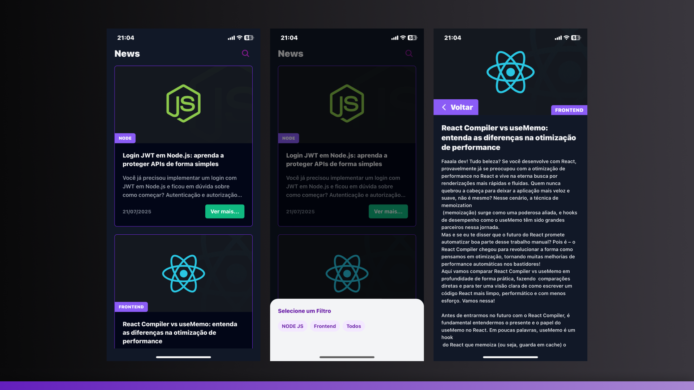

<h1 align="center"> App Blog GraphQL </h1>

<p align="center">
App Blog GraphQL é uma aplicação mobile moderna construída com React Native e Expo que oferece uma experiência completa de leitura de blog. Integrado com GraphQL através do Apollo Client, o aplicativo consome dados de um CMS Hygraph, proporcionando uma interface elegante e responsiva para visualização de artigos e posts sobre tecnologia.
</p>

<p align="center">
  <a href="#-tecnologias">Tecnologias</a>&nbsp;&nbsp;&nbsp;|&nbsp;&nbsp;&nbsp;
  <a href="#-projeto">Projeto</a>&nbsp;&nbsp;&nbsp;|&nbsp;&nbsp;&nbsp;
  <a href="#-layout">Layout</a>&nbsp;&nbsp;&nbsp;|&nbsp;&nbsp;&nbsp;
  <a href="#-como-executar">Como Executar</a>
</p>

<p align="center">
  
</p>

## 🚀 Tecnologias

Esse projeto foi desenvolvido com as seguintes tecnologias:

- React Native
- Expo
- TypeScript
- Apollo Client
- GraphQL
- Hygraph CMS
- Tailwind CSS (NativeWind)
- React Navigation
- React Native Safe Area Context
- Metro
<br/>

## 💻 Projeto

App Blog GraphQL é uma aplicação mobile que demonstra a integração entre React Native e GraphQL para criação de um blog moderno e performático. O projeto oferece uma experiência completa de leitura com as seguintes funcionalidades:

**✨ Funcionalidades Principais:**
- **Feed de Posts**: Listagem dinâmica de artigos com carregamento otimizado
- **Filtros por Categoria**: Sistema de filtragem para posts de Node.js, Frontend e outros temas
- **Detalhes do Post**: Visualização completa de artigos com formatação rica
- **Interface Responsiva**: Design moderno e adaptável com NativeWind
- **Cache Inteligente**: Gerenciamento avançado de cache com Apollo Client
- **Loading States**: Estados de carregamento elegantes para melhor UX
- **Modal de Filtros**: Interface intuitiva para seleção de categorias

**🛠️ Arquitetura Técnica:**
- **Apollo Client**: Gerenciamento de estado GraphQL com cache otimizado
- **Type Policies**: Configurações avançadas de cache para performance
- **Context Pattern**: Organização do provedor Apollo em contexto React
- **Custom Hooks**: Hooks personalizados para lógica de negócio
- **Component Architecture**: Estrutura modular com componentes reutilizáveis
- **TypeScript**: Tipagem estática para maior confiabilidade do código

**📱 Componentes Principais:**
- **Header**: Componente de cabeçalho com ações de filtro
- **PostCard**: Card reutilizável para exibição de posts
- **Home**: Tela principal com listagem e filtros
- **AboutPost**: Tela de detalhes do post selecionado

O projeto demonstra as melhores práticas de desenvolvimento React Native com GraphQL, incluindo otimização de performance, gerenciamento de estado e experiência do usuário, servindo como uma base sólida para aplicações mobile modernas.
<br/>

## 🎨 Layout

O layout do projeto foi desenvolvido com foco na experiência mobile, utilizando:
- **Design System**: Paleta de cores moderna com tons de roxo e cinza
- **Typography**: Hierarquia tipográfica clara e legível
- **Spacing**: Sistema de espaçamento consistente
- **Components**: Componentes reutilizáveis e acessíveis
- **Responsive**: Interface adaptável para diferentes tamanhos de tela

## 🚀 Como Executar

Para executar o projeto localmente, siga os passos abaixo:

### Pré-requisitos
- Node.js (versão 16 ou superior)
- npm ou yarn
- Expo CLI
- Expo Go (para testes em dispositivo físico)

### Instalação
```bash
# Clone o repositório
git clone https://github.com/crisfeitosa/app-blog-graphql.git

# Acesse a pasta do projeto
cd app-blog-graphql

# Instale as dependências
npm install

# Execute o projeto
npx expo start
```

### Executando no dispositivo
- **Android/iOS**: Escaneie o QR Code com o app Expo Go
- **Simulador**: Pressione 'a' para Android ou 'i' para iOS no terminal
- **Web**: Pressione 'w' para executar no navegador

### Configuração do GraphQL
O projeto está configurado para consumir dados do Hygraph CMS. O token de autenticação já está incluído no código para fins de demonstração.

---

<p align="center">
  Feito com 💜 por Cristiano Feitosa
</p>
